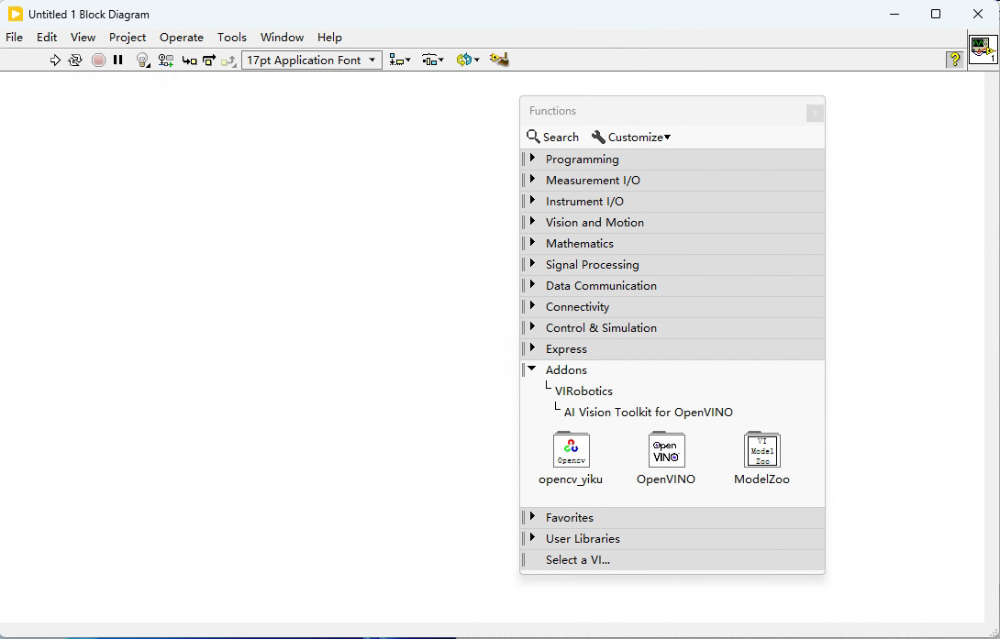

# 开发者指南

## 介绍

本章旨在帮助开发者全面了解并熟练使用**AI Vision Toolkit for OpenVINO (AIVT-OV)** 工具包。通过本章内容，您将学会如何快速入门、掌握基本操作、运用高级功能、解决常见问题以及优化性能，确保您能够高效地开发和部署基于AIVT-OV的应用程序。

通过阅读本章，您将学会：

- **创建并配置项目**：从头开始创建新项目，并正确配置所需环境和依赖项。
- **使用基本功能**：掌握AIVT-OV工具包的基本功能和操作，能够进行简单的图像处理和视觉识别任务。
- **运用高级功能**：了解并运用工具包的高级功能，进行复杂的深度学习和计算机视觉任务。
- **故障排除**：识别并解决开发过程中遇到的常见问题和错误。
- **部署应用**：学习如何将开发的应用部署到目标设备，并进行性能优化和硬件配置。

## 快速开始

### 函数介绍

安装好的OpenVINO工具包位于Block Diagram>>Functions>>Addons>>VIRobotics>>AI Vision Toolkit for OpenVINO，包括：`opencv_yiku`、`OpenVINO`、`ModelZoo`三个模块。

以下是这三个模块的详细介绍：

三个模块的详细介绍：

1. **opencv_yiku**：
   - 可调用市面上主流的USB摄像头、网络摄像头轻松采集图像，可**高速采集图像**
   - 提供数百个OpenCV中传统图像处理的算子，满足各种需求，如图像滤波、形态学操作、特征检测、模板匹配等。
   - 适用于基本图像处理和预处理任务。
2. **OpenVINO**：
   - 集成了OpenVINO™的深度学习推理引擎函数，支持加载和运行各种深度学习模型。
   - 支持多种硬件加速选项（如CPU、GPU、VPU），以优化推理性能。
3. **ModelZoo**：
   - 包含深度学习模型加载推理等函数，可用于图像分类、目标检测、图像分割等任务。
   - 提供了便捷的模型加载和配置接口，帮助开发者快速应用模型。

### 范例指南

范例可以在`LabVIEW install path\examples\VIRobotics\AI Vision\`路径中找到。也可以在LabVIEW的help中找到，具体方式为：Help>>Find Examples>>Directory Structure>>VIRobotics>>AI Vision

这些范例主要分为以下四部分内容：

1. **CV**：
   - 包含一些传统视觉处理内容的范例，如边缘检测、形态学操作、滤波等。
   - 示例：`Edge Detection.vi`、`Morphological Operations.vi`
2. **License Management**：
   - 主要用于部署时的一些激活范例。
   - 示例：`Activate License.vi`、`Check License Status.vi`
3. **Object Detection**：
   - 主要是YOLO系列的目标检测范例，包括YOLOv5/YOLOv6/YOLOv6/YOLOv6/YOLOv9/YOLOv8 Seg/YOLOv8 Pose/YOLOv8 OBB等模型的范例。
4. **Segment**：
   - 包含DeepLabv3/DeepLabv3+和yiku-seg的一些分割范例。

每个范例都提供了详细的步骤说明和注释，帮助开发者理解和应用这些功能。

## 故障排除

### 常见问题及解决方法

- **问题1：工具包安装失败**
  - 解决方案：检查是否关闭了所有安全防护软件，确保VIPM以管理员身份运行。
- **问题2：无法激活许可证**
  - 解决方案：确认输入的License ID和Key是否正确，检查网络连接是否正常。必要时联系技术支持获取帮助。
- **问题3：相机无法连接**
  - 解决方案：检查相机是否正确连接到计算机，确保驱动程序已正确安装。尝试更换USB端口或重新启动计算机。

###  错误代码及其含义

待更新……

## 部署

待更新……

## FAQ

- **问题1：如何检查我的许可证状态？**

  - 答：打开LabVIEW，点击Tools—VIRobotics License Manager，查看许可证状态。

- **问题2：如何更新工具包到最新版本？**

  - 答：使用VIPM搜索最新版本的AIVT-OV工具包并安装，确保关闭所有安全防护软件，并以管理员身份运行VIPM。

- **问题3：我的图像处理速度很慢，如何优化？**

  - 答：确保启用了硬件加速选项，优化图像处理算法，减少不必要的计算步骤。

    

如有其他问题，请通过support@virobotics.net联系技术支持团队。