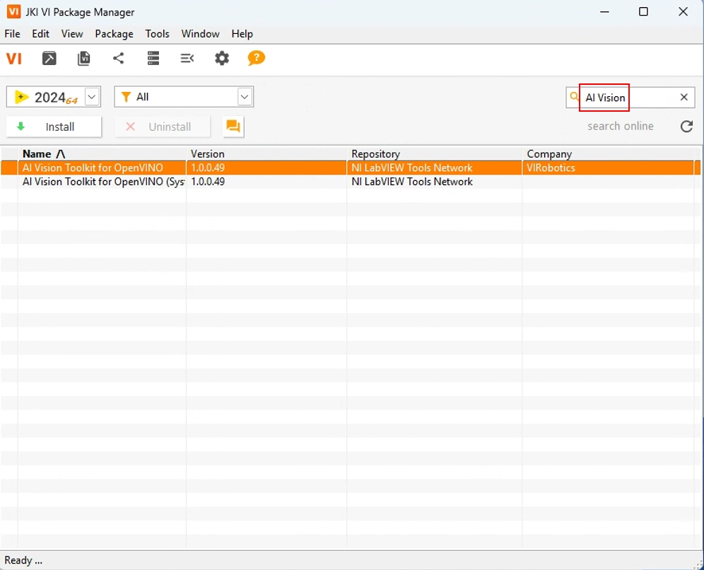
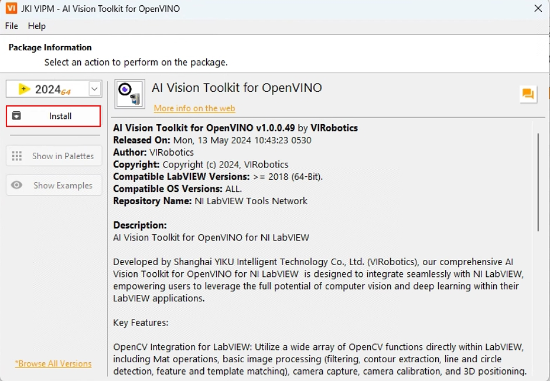
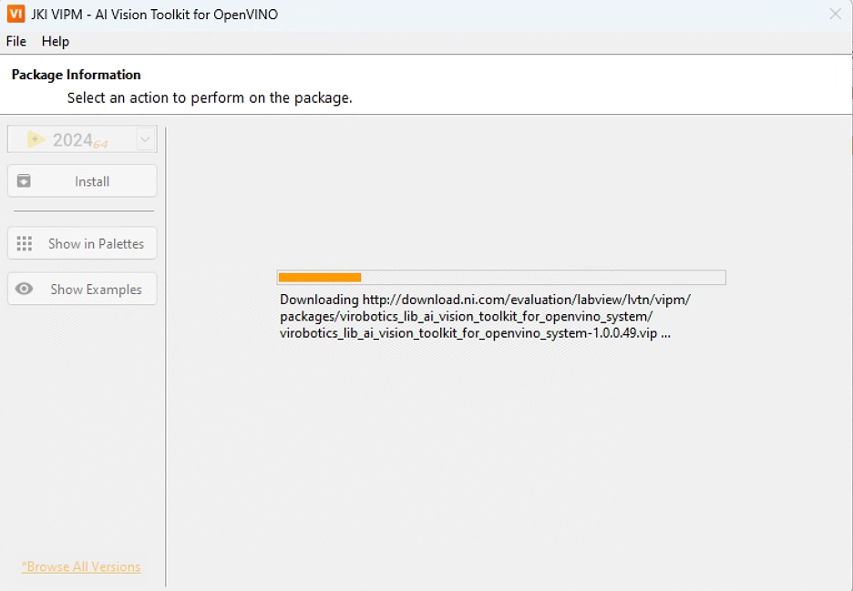
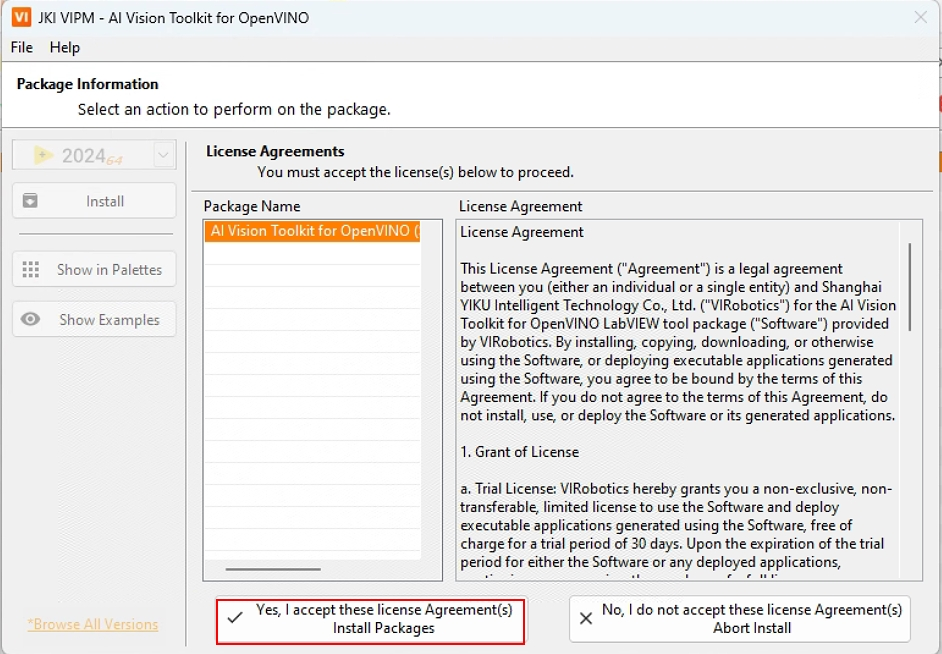
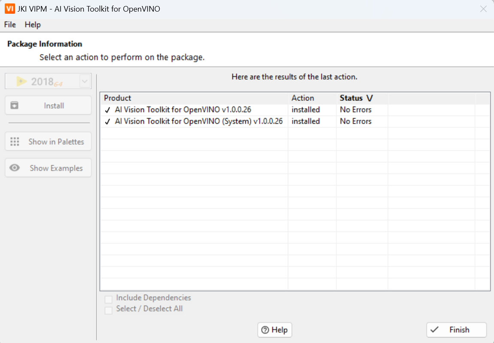

# 安装指南

## 系统要求 

**开发系统**

* **操作系统**：Windows 10（x64）及以上版本。
* **CPU**：基于Intel x86的架构（推荐使用第10代及以上处理器）。
* **内存**：8GB（推荐使用16GB及以上）。
* **显卡**：Intel显卡（集成显卡如Intel Iris Xe Graphics，独立显卡如A770）。

**部署系统**

* **操作系统**：Windows 10（x64）及以上版本。
* **CPU**：基于Intel x86的架构（推荐使用第10代及以上处理器）。
* **内存**：8GB（推荐使用16GB及以上）。
* **显卡**：Intel显卡（集成显卡如Intel Iris Xe Graphics，独立显卡如A770）。

## 软件要求

* **LabVIEW：** 2018（64位）及以上版本。
* **附加工具包：** NI Vision Development Module（NI视觉开发模块）。

  * 注意：运行工具包中的一些示例需要此工具包。

- **VIPM**：安装过程中VIPM（VI包管理器）必须以管理员身份运行，以处理依赖项和工具包设置。

## 安装步骤

请按照以下步骤操作并安装工具包。

1. 关闭电脑中的所有安全防护软件；

2. 下载**AI Vision Toolkit for OpenVINO**(以下简称：**AIVT-OV**)：**以管理员身份运行VIPM**，在VIPM中搜索关键字：AI Vision Toolkit ，可以找到工具包安装包，如下图所示；

   （注意：如果你不想在VIPM中下载AIVT-OV，可以在此[链接](https://bj11112.apps.aliyunfile.com/s/rxf91TXEC3Y           )中下载）

3. 双击“ai_vision_toolkit_for_openvino”，点击Install;

   

4. 此时开始下载该工具包

5. 选择接受许可协议；

6. 如下图所示即安装完毕，点击Finish即可；

   

到这里您已经使用VIPM成功安装了**AIVT-OV**，现在您可以在LabVIEW中开始您的深度学习旅程了。

如果您在安装过程中遇到任何问题或有任何疑问，请联系我们的支持团队寻求帮助。联系邮箱：support@virobotics.net

## 发行说明

**AIVT-OV**工具包不断更新。 最新发行说明可在VIPM中搜索。